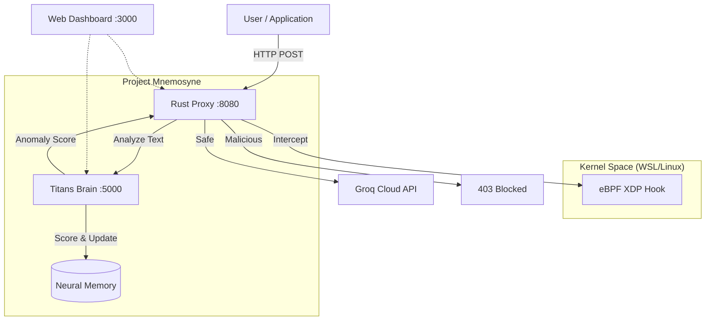

# Project Mnemosyne: Titans-Based Agent Firewall for LLMs


**Project Mnemosyne** is a stateful, kernel-level "Agent Firewall" designed to secure Large Language Model (LLM) traffic. It acts as a sidecar proxy that intercepts prompts, analyzes them for malicious intent (jailbreaks, injections) using a **Titans neural memory** architecture, and blocks threats at the network level using **eBPF (XDP)**.

## 🛡️ Key Features

- **🧠 Titans Neural Brain**: Uses Test-Time Training (TTT) and Neural Memory (LSTM + MLP) to detect anomalous patterns and "surprise" in user queries.
- **🐝 eBPF Kernel Hook**: High-performance packet inspection and blocking at the XDP (Express Data Path) layer in the Linux kernel.
- **🦀 Rust Interceptor**: A fast, async proxy (Axum) that sits between the user and the LLM (Groq API), enforcing security policies.
- **📊 Live Dashboard**: Real-time web UI to visualize system status, attack simulations, and blocked threats.
- **⚡ Low Latency**: Optimized for minimal overhead (<250ms added latency).

## 🏗️ Architecture



## 🚀 Quick Start

### Prerequisites
1. **Docker Desktop** (running)
2. **WSL2** (for eBPF kernel features on Windows)
3. **Groq API Key**
4. **Python 3.11+**

### 1. Start Core Services (Brain + Proxy)
```bash
# Set your API key
export GROQ_API_KEY=gsk_your_key_here

# Start services
docker compose up -d
```

### 2. Start eBPF Agent (WSL)
*Note: This must be run in a WSL terminal with sudo privileges.*
```bash
cd ebpf_probe
# Build first (if needed)
cargo build --package user_loader 
# Attach to interface
sudo ./target/debug/user_loader --iface eth0
```

### 3. Launch Dashboard
```bash
python -m http.server 3000 --directory dashboard
```
> Open **http://localhost:3000** in your browser.

## 📡 API Usage

### Send a Chat Request
Interact with the proxy just like the OpenAI API:

```bash
curl -X POST http://localhost:8080/chat/completions \
  -H "Content-Type: application/json" \
  -d '{
    "model": "llama3-8b-8192",
    "messages": [
      {"role": "user", "content": "What is the capital of France?"}
    ]
  }'
```

- **Safe Response (200 OK)**: Returns the LLM completion.
- **Blocked Response (403 Forbidden)**:
  ```json
  {
    "error": "security_violation",
    "message": "Request blocked due to anomalous pattern (surprise score: 5.8)"
  }
  ```

## 🧪 How It Works

### 1. The Titans Brain (Anomaly Detection)
The "Brain" uses a **Titans MAC** architecture. It maintains a short-term context (LSTM) and a long-term neural memory (MLP).
- **Surprise Score**: It calculates how "surprising" the next token in a prompt is based on its memory.
- **Anomaly**: High surprise scores indicate disjointed, obfuscated, or malicious prompts (e.g., "Ignore previous instructions").
- **Learning**: It learns from "normal" traffic (e.g., via `warmup` in the simulation) to reduce false positives.

### 2. eBPF Integration
We use **Aya** (Rust eBPF library) to load an XDP program into the kernel.
- **Monitoring**: Counts and inspects packets destined for the proxy port.
- **Blocking**: Can drop malicious packets before they reach user space (demonstrated in dashboard).

## 📂 Repository Structure

```
ebpf_agent/
├── brain/              # Python: Titans Neural Memory (PyTorch)
├── proxy/              # Rust: HTTP Proxy & Logic (Axum)
├── ebpf_probe/         # Rust: eBPF Kernel Program (Aya)
│   ├── ebpf_program/   # Kernel-space code (XDP)
│   └── user_loader/    # User-space loader
├── dashboard/          # HTML/JS Web Dashboard
├── tests/              # Python: Attack Simulation Scripts
└── docker-compose.yml  # Orchestration
```

## 🎮 Simulation & Verification

We provide a built-in simulation suite to verify security:

1. **Normal Traffic**: Standard queries ("What is the weather?") -> **Passed**
2. **Jailbreak**: "Ignore safety guidelines..." -> **Blocked** (High Surprise)
3. **Obfuscated**: "i-g-n-o-r-e..." -> **Blocked**

Run it via the Dashboard or CLI:
```bash
python tests/attack_sim.py
```

## 🤝 Contributing
Contributions welcome! Please check the `implementation_plan.md` for future roadmap items.

## 📝 License
MIT License
